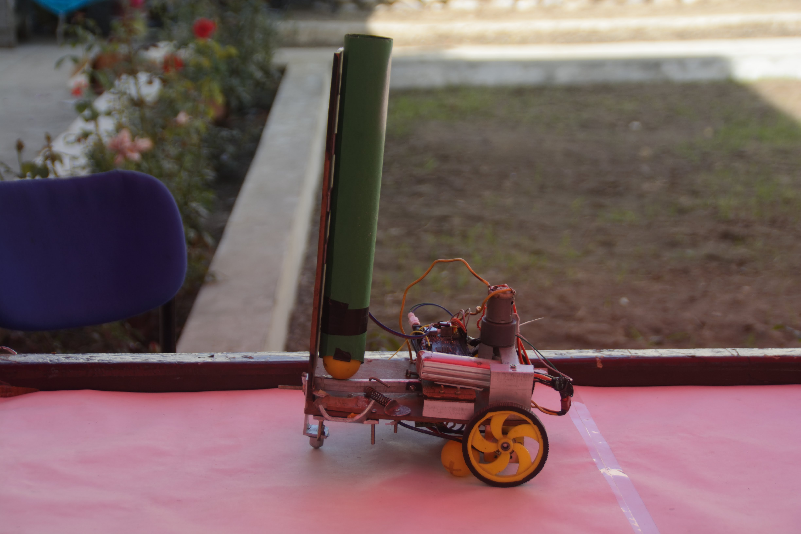
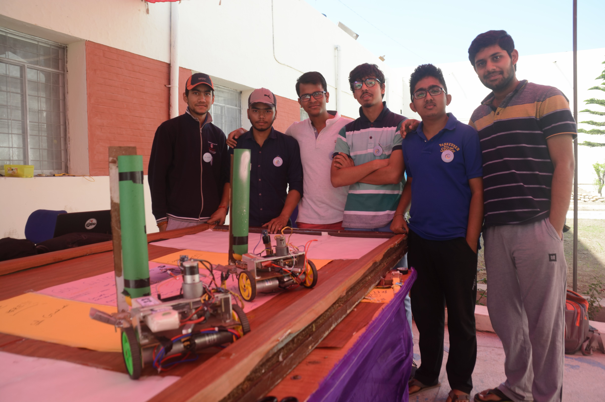
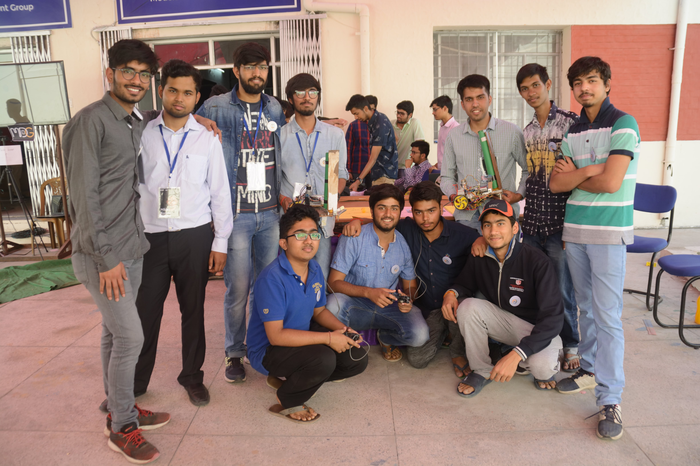

# Gun-Slingers
_A Fun Event_
___
## Abstract
___
The idea of this project was to make a game consisting of two small robots to play with each other.Both robots were loaded with 5 table tennis balls each . Both robots were placed on a table in their respective playing zones.Both were manually controlled via USB remote controller.Each player fire balls from their robot to the opponent's robot.The player with more hits on the opponent wins the game.

___
## Team Members
1. Abhishek Mishra
2. Kartik Chimpa
3. Navin Chandra Rai
4. Prakhar Mishra
5. Pratikesh Thakur
6. Satyansh Rai
7. Sourabh Patil
8. Vipul Goel
9. Vibhore Verma
___
## Mentors
1. Prashant Kumar
2. Uttkarsh Deepak
3. Aman Verma
___
## Electronic Components Used
* Arduino Mega ADK
* DC Motors
* 10 Amp Motor Drivers
* USB Control Remote
* IR Sensor
___
## Mechanichal Design
There were two parts of Mechanichal design:-
1. Diffrential Drive:- For Motion of the robot.
2. Hitting Arm :- To hit the tennis balls
## Working
Balls were loaded in a cylinder like structure above the hitting arm.Cylinder had a capacity of 5 balls max.Each time the arm was pulled for hitting , one ball came down from the Cylinder and it was hitted by the arm. We use a elevation at the place from where the balls came out to improve the trajectory of the balls.
## Limitations :
1. Trajectory was not so accurate every time.
2. Both robots were not exactly identical.
## Future Improvements
* Use of Machine learning to detect the opponents robot  to decide the trajectory of balls accordingly
* This can be of great use to Military services if we are able to detect the trajectory of missiles from the other side , hence the location of attacker and fire automatically from our side.
## Some Photos From Shristi 2018
* Our Team Members

* One with our Secretaries

